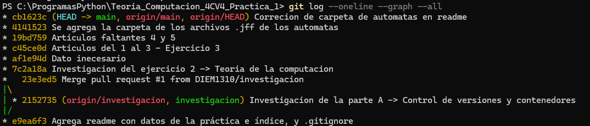
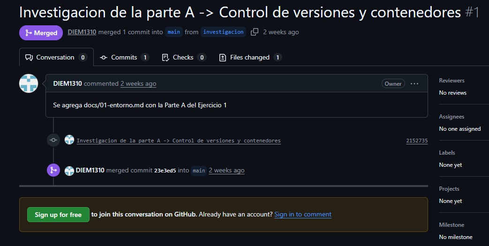
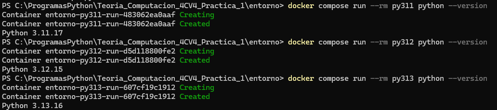

# Ejercicio 1. Entorno de trabajo: control de versiones y contenedores

## Parte A. Investigación

Esta investigación explica, con palabras sencillas, las herramientas que se usan en la práctica para guardar el trabajo (Git y GitHub) y para ejecutarlo siempre en las mismas condiciones (contenedores y entornos virtuales). Los ejemplos salen del propio repositorio de la práctica.

### 1. ¿Qué es un sistema de control de versiones y qué problema resuelve?

Un sistema de control de versiones es un programa que **registra los cambios** hechos a los archivos de un proyecto a lo largo del tiempo, para poder volver a una versión anterior cuando haga falta (Chacon y Straub, 2014). Se parece al "historial de versiones" de Google Docs, pero sirve para carpetas completas de un proyecto.

El problema que resuelve aparece cuando varias personas trabajan juntas. Sin este tipo de sistema, es común guardar copias con nombres como `trabajo_final_2` o `trabajo_final_NUEVO`, y es fácil equivocarse de copia o borrar sin querer el trabajo de alguien más (Chacon y Straub, 2014). Con el control de versiones, cada cambio queda guardado junto con **quién** lo hizo, **cuándo** y **por qué**. Así se pueden comparar versiones, recuperar archivos dañados y trabajar en equipo sin pisarse unos a otros.

### 2. ¿Cuál es la diferencia entre Git y GitHub?

**Git** es la herramienta (un programa) que se instala en la computadora y lleva el registro de los cambios del proyecto. Funciona de forma local, aun sin internet. **GitHub** es una página web (una plataforma) donde se guardan en internet los proyectos hechos con Git y donde varias personas pueden colaborar, por ejemplo revisando cambios y dejando comentarios (GitHub, Inc., s. f.-a).

Para recordarlo: Git es como el **cuaderno donde se anota la historia del proyecto**, y GitHub es la **nube donde se guarda una copia y se comparte**. Git se puede usar sin GitHub, pero GitHub necesita a Git para funcionar (GitHub, Inc., s. f.-a).

### 3. Conceptos básicos de Git y GitHub

Cada concepto se explica con palabras sencillas y con un ejemplo de esta práctica.

- **Repositorio.** Es la carpeta del proyecto que Git vigila. Guarda los archivos y también todo su historial de cambios. Puede haber una copia en internet (en GitHub) y otra en la computadora. *Ejemplo:* el repositorio `Teoria_Computacion_4CV4_Practica_1`, que existe en GitHub y también en una carpeta de la computadora.
- **Confirmación (commit).** Es como un **punto de guardado en un videojuego**: una "foto" del proyecto en un momento dado, acompañada de un mensaje que explica qué se cambió y por qué. Git le asigna un código único para poder volver a ese punto cuando se quiera (Chacon y Straub, 2014). *Ejemplo:* el commit con el mensaje "Agrega readme con datos de la práctica e índice, y .gitignore" guardó en el historial el README y el `.gitignore`.
- **Rama (branch).** Es una **línea de trabajo aparte**, como sacar una copia del trabajo para experimentar sin arruinar el original. Todo repositorio tiene una rama principal, que en GitHub se llama `main` por defecto (GitHub, Inc., s. f.-c). *Ejemplo:* para escribir este documento se crea una rama llamada `investigacion`, de modo que `main` no cambia hasta que el documento esté listo.
- **Fusión (merge).** Es **juntar los cambios de una rama con otra**, como pegar en el original lo que se hizo en la copia. *Ejemplo:* cuando el documento está terminado, la rama `investigacion` se fusiona con `main` y el documento pasa a formar parte de la versión principal.
- **Conflicto de fusión.** Ocurre cuando dos ramas cambiaron **el mismo lugar del mismo archivo de manera distinta** y Git no sabe con cuál quedarse (GitHub, Inc., s. f.-d). Git marca el archivo con los símbolos `<<<<<<<`, `=======` y `>>>>>>>`, y una persona debe elegir qué versión conservar. *Ejemplo:* si en una rama el README dice "Fecha de entrega: 22 de septiembre" y en otra dice "Fecha de entrega: 23 de septiembre", Git no puede decidir cuál es la correcta; quien hace la fusión escoge una y guarda el resultado.
- **Pull Request.** Es una **solicitud que se hace en GitHub** para que los cambios de una rama se incorporen a otra, normalmente a `main`. Antes de aceptar la fusión, otras personas pueden revisar los cambios, comentar y pedir ajustes (GitHub, Inc., s. f.-e). Es como decir: "Revisen lo que hice y, si está bien, agréguenlo al proyecto". *Ejemplo:* un Pull Request titulado "Agrega la investigación de la Parte A", con una descripción de lo que contiene, para llevar la rama `investigacion` a `main`.
- **Archivo `.gitignore`.** Es un archivo de texto con la **lista de cosas que Git debe ignorar**, es decir, que no se guardan en el repositorio: archivos temporales, generados automáticamente o que no forman parte del proyecto (Chacon y Straub, 2014). *Ejemplo:* en esta práctica se ignoran la carpeta `venv/` (el entorno virtual) y `__pycache__/`, porque se pueden volver a crear en cualquier momento.
- **Archivo README.** Es la **portada del proyecto**: un archivo que cuenta de qué trata, quién lo hizo y cómo usarlo. GitHub lo muestra automáticamente al abrir la página del repositorio (GitHub, Inc., s. f.-b). *Ejemplo:* el `README.md` de esta práctica incluye los datos del alumno y el índice de los documentos.

En conjunto, el flujo de trabajo típico es: se crea una **rama**, se hacen varios **commits** en ella, se abre un **Pull Request** en GitHub y, una vez revisado, se hace la **fusión** con `main`.

### 4. ¿Qué es un contenedor y en qué se diferencia de una máquina virtual?

Un **contenedor** es una "caja cerrada" donde se ejecuta una aplicación junto con todo lo que necesita para funcionar (técnicamente, es un proceso aislado). No depende de lo que esté instalado en la computadora y casi no influye sobre ella ni sobre otros contenedores (Docker, Inc., s. f.-j). Gracias a esto, el programa se ejecuta de la misma manera en distintas computadoras.

Una **máquina virtual** hace algo parecido, pero de forma más pesada: simula una computadora completa, con su propio sistema operativo (como Windows, macOS o Linux). Una manera de imaginarlo es esta: la máquina virtual es una **casa completa**, con su propia cocina, baño y tuberías; el contenedor es un **departamento** dentro de un edificio, con su espacio cerrado pero compartiendo con los demás la estructura y las tuberías, es decir, el "núcleo" del sistema operativo (Docker, Inc., s. f.-j; Microsoft, 2025).

| | Máquina virtual | Contenedor |
|---|---|---|
| **Arranque** | Más lento: debe encender un sistema operativo completo. | Rápido: no enciende un sistema operativo, solo inicia el programa. |
| **Tamaño** | Grande: suele ocupar decenas de gigabytes. | Pequeño: suele ocupar decenas de megabytes. |
| **Aislamiento** | Muy fuerte: cada máquina tiene su propio sistema operativo completo y queda separada del resto. | Más ligero: los contenedores comparten el núcleo del sistema operativo, por lo que la separación no es tan fuerte como en una máquina virtual. |

Fuentes de la tabla: Docker, Inc. (s. f.-k) y Microsoft (2025).

### 5. Imagen, contenedor, volumen y puerto publicado

- **Imagen.** Es la **receta lista para usar**: un paquete con todos los archivos, programas y configuraciones que hacen falta para crear un contenedor. Una vez creada no se puede modificar; si se necesita un cambio, se crea otra imagen a partir de ella (Docker, Inc., s. f.-l). *Ejemplo:* `python:3.12-slim` es una imagen que ya trae Python 3.12; en esta práctica se parte de ella para construir las imágenes del proyecto.
- **Contenedor.** Es el **platillo ya cocinado**: una imagen puesta en marcha. La imagen es la fuente de los archivos y la configuración con que arranca el contenedor (Docker, Inc., s. f.-l), y de una misma imagen pueden salir varios contenedores. *Ejemplo:* al ejecutar el servicio `py312`, Docker crea un contenedor llamado `tc_p1_py312` a partir de la imagen construida con Python 3.12.
- **Volumen.** Es un **espacio de almacenamiento fuera del contenedor**, conectado a él. Sirve para que los archivos no se pierdan, porque lo que un contenedor guarda dentro de sí mismo desaparece cuando se elimina (Docker, Inc., s. f.-i). Es como conectar una memoria USB: aunque se quite el contenedor, lo guardado en la USB sigue existiendo. *Ejemplo:* en el archivo `compose.yml` de esta práctica, la línea `..:/app` conecta la carpeta del proyecto de la computadora con la carpeta `/app` del contenedor, así el contenedor ve siempre el código y las pruebas más recientes. *Nota:* Docker distingue entre los *volúmenes* que él mismo administra y los *bind mounts*, que enlazan una carpeta concreta de la computadora, como en este ejemplo (Docker, Inc., s. f.-i); en el enunciado de la práctica se le llama volumen a ambos casos.
- **Puerto publicado.** Un puerto es como un **número de puerta o ventanilla** por donde una aplicación recibe visitas. Como el contenedor está aislado, desde la computadora no se puede entrar a él directamente. **Publicar un puerto** es abrir una conexión entre un puerto de la computadora y uno del contenedor, para poder usar la aplicación desde el navegador (Docker, Inc., s. f.-g). Se escribe `puerto_de_la_computadora:puerto_del_contenedor`. *Ejemplo:* en esta práctica, `8550:8550` conecta el puerto 8550 de la computadora con el 8550 del contenedor, y por eso la interfaz se abre en el navegador en `http://localhost:8550`.

### 6. ¿Qué es un entorno virtual de Python y por qué no cambia la versión del intérprete?

Python es un programa que ejecuta otros programas escritos en ese lenguaje; a ese programa se le llama **intérprete**. Muchos proyectos usan **bibliotecas**, que son paquetes de código ya hecho (como `flet` o `pytest`), y proyectos distintos pueden necesitar versiones distintas de la misma biblioteca. Un **entorno virtual** es una **carpeta aislada con su propia colección de bibliotecas** para un solo proyecto, de manera que lo que se instala ahí no se mezcla con otros proyectos ni con el Python del sistema (Python Software Foundation, s. f.-b). Es como tener una **caja de herramientas propia para cada proyecto**.

El entorno virtual **no modifica la versión del intérprete** porque **no trae un Python nuevo**: se construye sobre un Python que ya está instalado (el que se usó para crearlo) y lo reutiliza mediante una copia o un enlace a ese programa (Python Software Foundation, s. f.-b). Por eso, un entorno creado con Python 3.12 será de Python 3.12, y uno creado con Python 3.13 será de 3.13. Para usar otra versión hay que crear el entorno con otro intérprete que ya esté instalado. *Ejemplo:* en el `Dockerfile` de esta práctica, la orden `python -m venv /opt/venv` crea el entorno con el Python de la imagen; por eso se usan tres contenedores, cada uno con su versión de Python (3.11, 3.12 y 3.13) y su propio entorno virtual.

### 7. ¿Por qué conviene fijar la versión de la imagen (`python:3.12-slim`) en lugar de usar `python:latest`?

Las imágenes se identifican con una **etiqueta**, que es lo que va después de los dos puntos. En la imagen oficial de Python, la etiqueta `latest` significa "la versión más reciente", así que cambia cada vez que sale una nueva versión de Python; al consultar Docker Hub en septiembre de 2026 apuntaba a Python 3.14.7 (Docker, Inc., s. f.-h). Si se usara `python:latest`, el proyecto podría construirse hoy con una versión de Python y, meses después, con otra distinta, y programas que funcionaban podrían dejar de hacerlo. Es como pedir "la pieza más nueva" en lugar del "modelo exacto": no se sabe cuál llegará. Fijar la versión asegura que todos usen la misma y que el entorno sea **reproducible**, es decir, que se pueda construir de nuevo igual en otra computadora o en otro momento (Docker, Inc., s. f.-b).

Una precisión: una etiqueta como `3.12-slim` sigue recibiendo pequeñas correcciones dentro de la misma versión (por ejemplo, de seguridad). Si se necesitara una reproducción todavía más exacta, se puede fijar también la "huella" única de la imagen (Docker, Inc., s. f.-b). La parte `-slim` indica una versión **reducida** de la imagen, con solo lo mínimo para ejecutar Python; pesa menos, aunque trae menos herramientas, por lo que a veces falla la instalación de bibliotecas que necesitan herramientas extra (Docker, Inc., s. f.-h).

## Parte B. Repositorio

**Dirección del repositorio:** https://github.com/DIEM1310/Teoria_Computacion_4CV4_Practica_1

### B.1 Qué se hizo

| Requisito del enunciado | Cómo se cumplió |
|---|---|
| Cuenta de GitHub y repositorio | Cuenta `DIEM1310` y repositorio público `Teoria_Computacion_4CV4_Practica_1`. |
| `README.md` con nombre, boleta, grupo, carrera e índice | El [README](../README.md) trae esos datos, además de la unidad de aprendizaje, el profesor y la fecha de entrega, y un índice con un enlace a cada documento de la práctica. |
| `.gitignore` | Excluye `venv/`, `.venv/`, `env/`, `__pycache__/`, `*.pyc`, `.pytest_cache/` y `salidas/` (lo que la aplicación del Ejercicio 5 puede volver a generar), entre otros. **No** excluye los archivos `.jff`: son los autómatas del Ejercicio 4 y forman parte de lo que se entrega. |
| Al menos cinco confirmaciones con mensajes descriptivos | El historial tiene más de cinco confirmaciones y cada mensaje dice qué cambió (por ejemplo, "Investigacion del ejercicio 2 -> Teoria de la computacion"). La primera captura de abajo las muestra. |
| Rama, cambio, Pull Request y fusión | Se creó la rama `investigacion` y en ella se hizo el cambio: el documento `docs/01-entorno.md` con la Parte A. Se abrió el Pull Request #1, "Investigacion de la parte A -> Control de versiones y contenedores", con su descripción, y se fusionó en `main` el 21 de septiembre de 2026. |

### B.2 Evidencia

Salida de `git log --oneline --graph --all`, donde se ven las confirmaciones y la fusión de la rama:



Pull Request #1 ya fusionado:



## Parte C. Los tres entornos de Python

### C.1 Qué se construyó

Se levantaron **tres contenedores**, uno por cada versión de Python: 3.11, 3.12 y 3.13. Cada uno parte de una imagen oficial de Python distinta y tiene su **propio entorno virtual** en `/opt/venv`. Se usó **Docker Desktop** (no Podman), con Docker 29.8.1 y Docker Compose v5.5.1, en Windows 11 con motor Linux.

Lo definen cuatro archivos del repositorio: [`entorno/Dockerfile`](../entorno/Dockerfile), [`entorno/compose.yml`](../entorno/compose.yml), [`requirements.txt`](../requirements.txt) y [`pytest.ini`](../pytest.ini). Para no perderse, una analogía: el **Dockerfile** es la receta para armar la "computadora de trabajo" (la imagen); el **compose.yml** es el instructivo para encenderla (el contenedor) y conectarla con la computadora real; y el **requirements.txt** es la lista exacta de ingredientes de Python.

### C.2 ¿Por qué tres contenedores y no uno con tres entornos virtuales?

Un entorno virtual **no trae un Python propio**: se crea sobre el Python que lo creó y usa una copia o un enlace a él (Python Software Foundation, s. f.-b). Por eso un entorno virtual no puede cambiar la versión del intérprete. Con un solo contenedor y tres entornos virtuales habría que instalar antes tres Pythons distintos en la imagen; es más sencillo que cada contenedor traiga su versión de Python desde la imagen base y que el entorno virtual se cree encima (Hurtado Avilés, 2026, p. 2).

El entorno virtual está en `/opt/venv` y no dentro de `/app` por una razón concreta. El volumen de `compose.yml` monta el repositorio sobre `/app`, y cuando se monta una carpeta sobre otra que ya tiene archivos, los que había quedan **ocultos** por el montaje (Docker, Inc., s. f.-a). Si el entorno virtual estuviera en `/app`, dejaría de verse al arrancar el contenedor.

### C.3 El Dockerfile, línea por línea

El mismo Dockerfile sirve para las tres versiones. Las líneas que empiezan con `#` son comentarios: no hacen nada, solo explican.

| Línea | Qué hace, en palabras sencillas |
|---|---|
| `ARG PYTHON_VERSION=3.12` | Crea una "casilla" llamada `PYTHON_VERSION` con el valor 3.12, por si nadie le da otro. Es la única instrucción que puede ir antes de `FROM`, y por eso su valor se puede usar en esa línea (Docker, Inc., s. f.-e). `compose.yml` le da el valor 3.11, 3.12 o 3.13, y así un solo Dockerfile sirve para las tres versiones. |
| `FROM python:${PYTHON_VERSION}-slim` | Punto de partida: la imagen oficial de Python con la versión de la casilla, por ejemplo `python:3.11-slim`. La variante `slim` es la versión reducida, con lo mínimo para ejecutar Python (Docker, Inc., s. f.-h). |
| `RUN python -m venv /opt/venv` | Crea el entorno virtual en `/opt/venv` con el Python de la imagen, por eso hereda su versión (Python Software Foundation, s. f.-b). `RUN` ejecuta una orden mientras se construye la imagen y guarda el resultado como una capa nueva (Docker, Inc., s. f.-e). |
| `ENV PATH="/opt/venv/bin:$PATH"` | Pone la carpeta `bin` del entorno virtual al principio de la lista de lugares donde el sistema busca programas (`PATH`). Es lo mismo que hace "activar" un entorno virtual (Python Software Foundation, s. f.-b): desde aquí, `python` y `pip` son los del entorno. `ENV` hace que la variable siga existiendo cuando el contenedor se ejecuta (Docker, Inc., s. f.-e). |
| `WORKDIR /app` | Define `/app` como carpeta de trabajo para las instrucciones que siguen (`RUN`, `COPY` y `CMD`) (Docker, Inc., s. f.-e). |
| `COPY requirements.txt .` | Copia solo el archivo de dependencias, desde el repositorio hasta `/app` (Docker, Inc., s. f.-e). |
| `RUN pip install --no-cache-dir --upgrade pip && pip install --no-cache-dir -r requirements.txt` | Primero actualiza `pip` (`--upgrade`) y después instala las bibliotecas que enlista `requirements.txt` (`-r`) (Python Packaging Authority, s. f.-b). `--no-cache-dir` apaga la memoria (caché) de `pip`; su documentación recomienda no desactivarla salvo cuando ya existe un caché de nivel superior, como las capas de los builds de contenedores (Python Packaging Authority, s. f.-a). La barra `\` solo parte la línea y `&&` encadena los dos pasos. |
| `COPY . .` | Copia el resto del repositorio a `/app`. Va **después** de instalar las bibliotecas a propósito: cuando algo cambia, Docker reconstruye ese paso y todos los que le siguen, así que conviene poner antes lo que cambia poco (Docker, Inc., s. f.-f). Si solo cambia el código, las bibliotecas no se vuelven a instalar. |
| `ENV FLET_FORCE_WEB_SERVER=true` y `ENV FLET_SERVER_PORT=8550` | Variables para Flet: hacen que arranque como servidor web, porque en el contenedor no hay escritorio, y que atienda en el puerto 8550 (Hurtado Avilés, 2026, p. 9). |
| `CMD ["python", "src/app.py"]` | Orden por defecto al encender el contenedor: ejecutar la aplicación. Solo cuenta el último `CMD`, y se puede reemplazar al arrancar el contenedor (Docker, Inc., s. f.-e); eso es lo que hace `compose.yml` en `py311` y `py313`. |

### C.4 El compose.yml, línea por línea

Se explica el servicio `py311`; `py312` y `py313` son iguales, salvo lo que se indica.

| Línea | Qué hace, en palabras sencillas |
|---|---|
| `services:` | Lista los contenedores del proyecto. Hay tres, `py311`, `py312` y `py313`; a cada uno Compose le llama "servicio". |
| `build:` | Dice cómo fabricar la imagen del servicio. Sus tres datos van enseguida. |
| `context: ..` | La carpeta de la que Docker toma los archivos al construir. Una ruta relativa se cuenta desde la carpeta del proyecto, que es donde está el `compose.yml` (Docker, Inc., s. f.-c); como el archivo está en `entorno/`, `..` es la carpeta de arriba, o sea, la raíz del repositorio. |
| `dockerfile: entorno/Dockerfile` | Cuál Dockerfile usar; la ruta se cuenta desde el contexto (Docker, Inc., s. f.-c). |
| `args:` y `PYTHON_VERSION: "3.11"` | Le dan valor a la casilla `ARG PYTHON_VERSION` del Dockerfile (Docker, Inc., s. f.-c). **Es la única diferencia entre los tres servicios**: 3.11, 3.12 o 3.13. |
| `container_name: tc_p1_py311` | Un nombre fijo para el contenedor, en lugar de uno generado (Docker, Inc., s. f.-d). Con `docker compose run`, Docker crea contenedores temporales con otro nombre; en las capturas se ven como `entorno-py311-run-…`. |
| `volumes:` y `- ..:/app` | El "puente de archivos": la raíz del repositorio (`..`) aparece dentro del contenedor como `/app`. Se lee `carpeta_de_la_computadora:carpeta_del_contenedor`; una ruta relativa se cuenta desde el `compose.yml` y debe empezar con `.` o `..` (Docker, Inc., s. f.-d). Lo que se cambie de un lado se ve del otro (Docker, Inc., s. f.-a), por eso el contenedor siempre ve el código más reciente. |
| `command: pytest -q` | Reemplaza la orden por defecto del Dockerfile (Docker, Inc., s. f.-d). En `py311` y `py313`, al encenderlos se ejecutan las pruebas; `-q` es el modo silencioso. |
| `ports:` y `- "8550:8550"` | Solo en `py312`. Conectan un puerto de la computadora con uno del contenedor, en el orden `puerto_de_la_computadora:puerto_del_contenedor` (Docker, Inc., s. f.-d, s. f.-g). Así, la interfaz que Flet sirve dentro del contenedor se abre en el navegador en `http://localhost:8550`. |

### C.5 `requirements.txt`, `pytest.ini` y `.dockerignore`

**`requirements.txt`.** Es la lista de las bibliotecas de Python con la **versión exacta** de cada una (`nombre==versión`), para que el entorno se pueda reconstruir igual en cualquier momento (Hurtado Avilés, 2026, p. 2). Se obtuvo en dos pasos. Primero se instalaron `flet[web]==0.86.5` y `pytest==8.3.4`, las dos que pide el Anexo 2. Luego se ejecutó `pip freeze` dentro de un contenedor para ver todo lo que había quedado instalado, dependencias incluidas (Hurtado Avilés, 2026, p. 9). Resultaron **33 paquetes**, y la lista fue **idéntica en los tres contenedores** (3.11, 3.12 y 3.13), así que un solo archivo sirve para los tres. Después se reconstruyeron las tres imágenes con el archivo ya fijado y `pip freeze` volvió a coincidir con él en cada una. En la lista aparece `flet-web`: es el componente que agrega `flet[web]` para servir la aplicación como página web, necesario en un contenedor sin escritorio (Hurtado Avilés, 2026, p. 9).

**`pytest.ini`.** Tiene dos líneas. `pythonpath = src` hace que las pruebas encuentren los módulos que están en `src/` sin modificar el `PYTHONPATH` (Hurtado Avilés, 2026, p. 10), y `testpaths = tests` le dice a pytest dónde buscar las pruebas.

**`.dockerignore`.** Este archivo no viene en el Anexo 2; se agregó. Como el contexto de construcción es la raíz del repositorio y `COPY . .` copia todo lo que haya ahí, sin él viajarían a la imagen cosas innecesarias. Un archivo `.dockerignore` sirve para excluir lo que no es relevante para la construcción (Docker, Inc., s. f.-b). Aquí se excluyen, entre otros, `.git`, los entornos virtuales, `docs/`, `evidencias/` y `automatas/`.

### C.6 Verificación

Desde la carpeta `entorno/` se construyeron las tres imágenes con `docker compose build` y se le pidió a cada contenedor su versión de Python con `docker compose run --rm py311 python --version` (y lo mismo con `py312` y `py313`). Cada uno reportó la versión que le corresponde:

| Servicio | Imagen base | Versión que reporta |
|---|---|---|
| `py311` | `python:3.11-slim` | Python 3.11.17 |
| `py312` | `python:3.12-slim` | Python 3.12.15 |
| `py313` | `python:3.13-slim` | Python 3.13.16 |



La captura muestra el comando y la respuesta de cada contenedor.

### C.7 Justificación de las tres versiones

Para elegir las versiones se consultaron dos fuentes: lo que **Flet** exige de Python y el **calendario de Python**, que dice hasta cuándo recibe correcciones cada versión.

**Lo que exige Flet.** La versión de Flet que se instaló, la 0.86.5 (publicada el 1 de agosto de 2026), declara en PyPI que requiere `Python >=3.10` (Appveyor Systems Inc., 2026). Es un mínimo sin límite superior: acepta la 3.10 y cualquiera posterior. Las tres imágenes lo comprobaron en la práctica, porque Flet se instaló sin errores en 3.11, 3.12 y 3.13.

**El calendario de Python.** Cada versión recibe primero correcciones de errores (alrededor de dos años) y después solo correcciones de seguridad, hasta cumplir cinco años desde su primera publicación. En ese momento llega a su fin de vida y ya no recibe ningún cambio (Python Software Foundation, s. f.-a). Esto decía el calendario al consultarlo el 5 de octubre de 2026:

| Versión | Primera publicación | Estado | Fin de vida | ¿La admite Flet 0.86.5? |
|---|---|---|---|---|
| 3.10 | 4 de octubre de 2021 | fin de vida | 1 de octubre de 2026 | Sí (es su mínimo) |
| 3.11 | 24 de octubre de 2022 | solo seguridad | octubre de 2027 | Sí |
| 3.12 | 2 de octubre de 2023 | solo seguridad | octubre de 2028 | Sí |
| 3.13 | 7 de octubre de 2024 | solo seguridad | octubre de 2029 | Sí |

Fuentes de la tabla: Appveyor Systems Inc. (2026) y Python Software Foundation (s. f.-a).

Con eso, la elección de cada servicio queda así:

- **`py311`: la más antigua que sigue recibiendo correcciones.** Flet admite desde la 3.10, pero esa versión ya llegó a su fin de vida (1 de octubre de 2026), y no conviene construir un entorno nuevo sobre una versión que ya no recibe ni correcciones de seguridad. La 3.11 es la más antigua que Flet admite y que todavía recibe correcciones de seguridad, hasta octubre de 2027.
- **`py312`: la versión de referencia del curso.** Es la que sirve la interfaz gráfica (Hurtado Avilés, 2026, p. 2) y tiene soporte de seguridad hasta octubre de 2028.
- **`py313`: una versión reciente.** Con soporte hasta octubre de 2029, sirve para comprobar que el programa no depende de un comportamiento que haya cambiado entre versiones (Hurtado Avilés, 2026, p. 2). Ya existe una versión más nueva, la 3.14, pero el enunciado fija estas tres.

### C.8 Cómo reproducirlo

Desde la carpeta `entorno/`:

```bash
docker compose build
docker compose run --rm py311 python --version
docker compose run --rm py312 python --version
docker compose run --rm py313 python --version
```

Las pruebas con pytest y la interfaz de Flet se ejecutan con estos mismos servicios en el Ejercicio 5.

## Referencias

Appveyor Systems Inc. (2026). *flet* (Versión 0.86.5) [Paquete de Python]. Python Package Index. Recuperado el 5 de octubre de 2026, de https://pypi.org/project/flet/0.86.5/

Chacon, S. y Straub, B. (2014). *Pro Git* (2.ª ed.). Apress. https://git-scm.com/book/es/v2

Docker, Inc. (s. f.-a). *Bind mounts*. Docker Docs. Recuperado el 5 de octubre de 2026, de https://docs.docker.com/engine/storage/bind-mounts/

Docker, Inc. (s. f.-b). *Building best practices*. Docker Docs. Recuperado el 21 de septiembre de 2026, de https://docs.docker.com/build/building/best-practices/

Docker, Inc. (s. f.-c). *Compose Build Specification*. Docker Docs. Recuperado el 5 de octubre de 2026, de https://docs.docker.com/reference/compose-file/build/

Docker, Inc. (s. f.-d). *Define services in Docker Compose*. Docker Docs. Recuperado el 5 de octubre de 2026, de https://docs.docker.com/reference/compose-file/services/

Docker, Inc. (s. f.-e). *Dockerfile reference*. Docker Docs. Recuperado el 5 de octubre de 2026, de https://docs.docker.com/reference/dockerfile/

Docker, Inc. (s. f.-f). *Optimize cache usage in builds*. Docker Docs. Recuperado el 5 de octubre de 2026, de https://docs.docker.com/build/cache/optimize/

Docker, Inc. (s. f.-g). *Publishing and exposing ports*. Docker Docs. Recuperado el 21 de septiembre de 2026, de https://docs.docker.com/get-started/docker-concepts/running-containers/publishing-ports/

Docker, Inc. (s. f.-h). *python - Official Image*. Docker Hub. Recuperado el 21 de septiembre de 2026, de https://hub.docker.com/_/python

Docker, Inc. (s. f.-i). *Volumes*. Docker Docs. Recuperado el 21 de septiembre de 2026, de https://docs.docker.com/engine/storage/volumes/

Docker, Inc. (s. f.-j). *What is a container?* Docker Docs. Recuperado el 21 de septiembre de 2026, de https://docs.docker.com/get-started/docker-concepts/the-basics/what-is-a-container/

Docker, Inc. (s. f.-k). *What is a container?* [Página de recursos]. Docker. Recuperado el 21 de septiembre de 2026, de https://www.docker.com/resources/what-container/

Docker, Inc. (s. f.-l). *What is an image?* Docker Docs. Recuperado el 21 de septiembre de 2026, de https://docs.docker.com/get-started/docker-concepts/the-basics/what-is-an-image/

GitHub, Inc. (s. f.-a). *About Git*. GitHub Docs. Recuperado el 21 de septiembre de 2026, de https://docs.github.com/en/get-started/using-git/about-git

GitHub, Inc. (s. f.-b). *About the repository README file*. GitHub Docs. Recuperado el 21 de septiembre de 2026, de https://docs.github.com/en/repositories/managing-your-repositorys-settings-and-features/customizing-your-repository/about-readmes

GitHub, Inc. (s. f.-c). *Branches*. GitHub Docs. Recuperado el 21 de septiembre de 2026, de https://docs.github.com/en/pull-requests/collaborating-with-pull-requests/proposing-changes-to-your-work-with-pull-requests/about-branches

GitHub, Inc. (s. f.-d). *Merge conflicts*. GitHub Docs. Recuperado el 21 de septiembre de 2026, de https://docs.github.com/en/pull-requests/collaborating-with-pull-requests/addressing-merge-conflicts/about-merge-conflicts

GitHub, Inc. (s. f.-e). *Pull requests*. GitHub Docs. Recuperado el 21 de septiembre de 2026, de https://docs.github.com/en/pull-requests/collaborating-with-pull-requests/proposing-changes-to-your-work-with-pull-requests/about-pull-requests

Hurtado Avilés, G. (2026). *Práctica 1: Operaciones básicas sobre lenguajes* [Enunciado de práctica]. Escuela Superior de Cómputo, Instituto Politécnico Nacional.

Microsoft. (2025). *Containers vs. virtual machines*. Microsoft Learn. https://learn.microsoft.com/en-us/virtualization/windowscontainers/about/containers-vs-vm

Python Packaging Authority. (s. f.-a). *Caching*. pip documentation v26.2.1. Recuperado el 5 de octubre de 2026, de https://pip.pypa.io/en/stable/topics/caching/

Python Packaging Authority. (s. f.-b). *pip install*. pip documentation v26.2.1. Recuperado el 5 de octubre de 2026, de https://pip.pypa.io/en/stable/cli/pip_install/

Python Software Foundation. (s. f.-a). *Status of Python versions*. Python Developer's Guide. Recuperado el 5 de octubre de 2026, de https://devguide.python.org/versions/

Python Software Foundation. (s. f.-b). *venv — Creation of virtual environments*. Python 3.14.7 documentation. Recuperado el 21 de septiembre de 2026, de https://docs.python.org/3/library/venv.html
