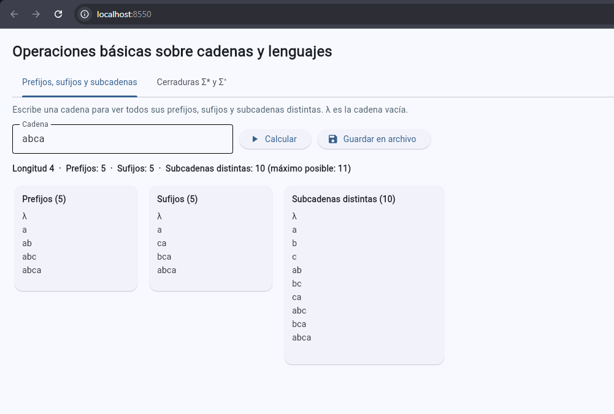
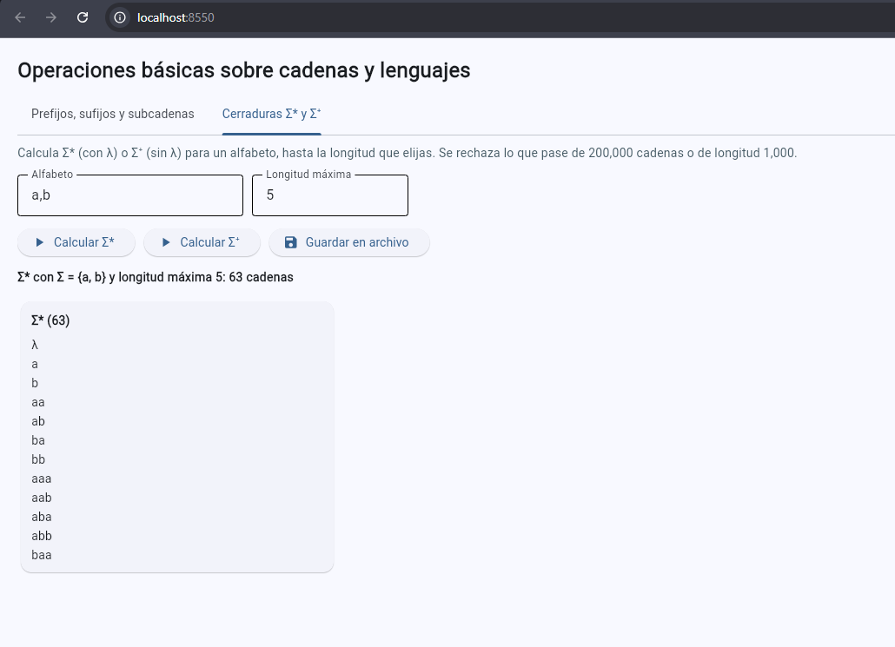
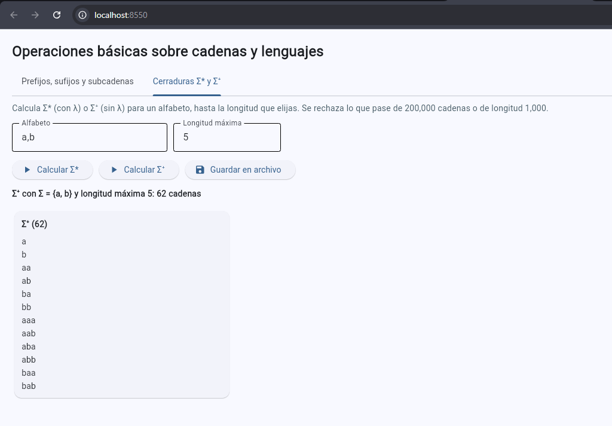

# Ejercicio 5. Aplicación con interfaz gráfica

La aplicación calcula las operaciones básicas del Ejercicio 2 sobre cadenas y lenguajes y muestra los resultados en una página web hecha con Flet. La página se sirve desde el contenedor `py312` y se abre en el navegador, en `http://localhost:8550`. Tiene dos pestañas: una para los **prefijos, sufijos y subcadenas** de una cadena, y otra para las **cerraduras `Σ*` y `Σ⁺`** de un alfabeto.

## 1. Cómo está organizado el código

| Archivo | Qué contiene |
|---|---|
| [`src/lenguajes.py`](../src/lenguajes.py) | El **núcleo**: las funciones que calculan prefijos, sufijos, subcadenas, `Σ*` y `Σ⁺`. Son funciones puras: solo reciben datos y devuelven resultados; no usan Flet ni leen o escriben archivos. |
| [`src/app.py`](../src/app.py) | La **interfaz**: arma la pantalla, llama a las funciones del núcleo, muestra los resultados y guarda los archivos de texto. No calcula nada por su cuenta. |
| [`tests/test_lenguajes.py`](../tests/test_lenguajes.py) | Las **pruebas automáticas** del núcleo, con pytest. |
| [`pytest.ini`](../pytest.ini) | Le dice a pytest dónde están el código (`src`) y las pruebas (`tests`). |

**Por qué se separan.** Es como el motor y el tablero de un coche: el motor (el núcleo) se puede probar solo, sin encender el tablero (la interfaz). Como el núcleo no depende de Flet, las pruebas lo ejecutan directamente, sin abrir ninguna ventana.

**Cómo se ejecuta.** Desde la carpeta `entorno/`:

```bash
docker compose up py312                    # la interfaz; abrir http://localhost:8550
docker compose run --rm py311 pytest -q    # las pruebas (y lo mismo con py312 y py313)
```

El botón **Guardar en archivo** escribe un `.txt` en la carpeta `salidas/` del proyecto. Git la ignora, porque son resultados que el programa puede volver a generar.

## 2. Operación 1: subcadenas, prefijos y sufijos

### 2.1 Definiciones y convención

Se usan las definiciones habituales de la teoría de lenguajes (Majercik, 2019):

- `x` es **subcadena** de `w` si aparece de forma consecutiva dentro de `w`.
- `p` es **prefijo** de `t` si `t = px` para alguna cadena `x`; es el pedazo del principio.
- `s` es **sufijo** de `t` si `t = xs` para alguna cadena `x`; es el pedazo del final.

De esas definiciones se desprenden dos hechos (Majercik, 2019): toda cadena es prefijo, sufijo y subcadena de sí misma, y **la cadena vacía `λ` es prefijo, sufijo y subcadena de toda cadena**. Para `λ` basta tomar `x = t` en `t = λt`, que siempre se cumple.

**Convención del programa.** La cadena vacía **sí figura** entre los prefijos y los sufijos, y también la propia cadena. Se eligió así por tres razones:

1. Es lo que dicen las definiciones: no hay ninguna razón para dejarla fuera.
2. Es la misma convención del Ejercicio 2, donde `λ` es la cadena vacía y `Σ⁰ = {λ}`.
3. Los números salen limpios: hay un prefijo por cada longitud posible, de 0 a n (ver 2.2). Si se excluyera `λ`, habría que tratar aparte a la cadena vacía.

En pantalla y en los archivos, la cadena vacía se escribe `λ`. Por ejemplo, para `abc`:

- Prefijos: `λ`, `a`, `ab`, `abc`.
- Sufijos: `λ`, `c`, `bc`, `abc`.
- Subcadenas distintas: `λ`, `a`, `b`, `c`, `ab`, `bc`, `abc`.

### 2.2 Cuántos hay

**Prefijos y sufijos: n + 1.** Una cadena de longitud n tiene un prefijo por cada longitud posible: los primeros 0 símbolos (`λ`), los primeros 1, los primeros 2, y así hasta los primeros n (la cadena completa). Son n + 1 prefijos y todos son distintos, porque tienen longitudes distintas. Con el mismo razonamiento, hay n + 1 sufijos. Si no se contara `λ`, serían n.

**Subcadenas distintas: como máximo n(n + 1)/2 + 1.** Una subcadena no vacía queda determinada por dónde empieza y dónde termina. Si empieza en el símbolo 1 puede terminar en n lugares distintos; si empieza en el 2, en n − 1; y así hasta el último símbolo, que solo admite 1. Eso da n + (n − 1) + … + 1 = n(n + 1)/2 subcadenas, y al sumar `λ` resulta n(n + 1)/2 + 1. Es un **máximo**: se alcanza cuando todos los símbolos son distintos. Si hay símbolos repetidos, algunas subcadenas coinciden y se cuentan una sola vez, así que quedan menos.

| Cadena | n | Prefijos | Sufijos | Subcadenas distintas | Máximo posible | Comentario |
|---|---|---|---|---|---|---|
| `λ` | 0 | 1 | 1 | 1 | 1 | La cadena vacía solo tiene a `λ` |
| `abcde` | 5 | 6 | 6 | 16 | 16 | Símbolos todos distintos: alcanza el máximo |
| `abca` | 4 | 5 | 5 | 10 | 11 | La `a` aparece dos veces y cuenta una sola |
| `abab` | 4 | 5 | 5 | 8 | 11 | Se repiten `a`, `b` y `ab` |
| `aaaa` | 4 | 5 | 5 | 5 | 11 | El mínimo para n = 4: `λ`, `a`, `aa`, `aaa`, `aaaa` |

### 2.3 Orden y archivo de texto

Los resultados se muestran de la cadena más corta a la más larga y, entre las de la misma longitud, en orden de diccionario (Majercik, 2019). En las subcadenas es el orden alfabético; en `Σ*` y `Σ⁺`, el orden en que se escribió el alfabeto. El botón **Guardar en archivo** crea `salidas/prefijos_sufijos_subcadenas_<fecha>_<hora>.txt` con las tres listas completas y la cantidad de cada una.

### 2.4 Captura



La captura muestra la cadena `abca`, servida desde `localhost:8550`: 5 prefijos, 5 sufijos y 10 subcadenas distintas. El máximo posible para n = 4 es 11, pero la `a` se repite.

## 3. Operación 2: cerradura de Kleene `Σ*` y cerradura positiva `Σ⁺`

### 3.1 Qué son y qué calcula el programa

Con `k = |Σ|` símbolos, `Σⁿ` es el conjunto de las cadenas de longitud n y tiene `kⁿ` cadenas (Hopcroft et al., 2007; ver el Ejercicio 2). Entonces:

- `Σ* = Σ⁰ ∪ Σ¹ ∪ Σ² ∪ …` incluye a `λ`, porque `Σ⁰ = {λ}`.
- `Σ⁺ = Σ¹ ∪ Σ² ∪ …` no incluye a `λ`; es `Σ*` sin la cadena vacía.

`Σ*` tiene una cantidad infinita de cadenas (Majercik, 2019), y `Σ⁺` también, porque solo le falta `λ`. Un programa no puede listar algo infinito. Por eso la aplicación calcula **hasta la longitud máxima n que elige el usuario**: `Σ⁰ ∪ Σ¹ ∪ … ∪ Σⁿ` para `Σ*`, y lo mismo sin `Σ⁰` para `Σ⁺`.

El alfabeto se escribe como `a, b` o como `ab`. Igual que en el Ejercicio 2, es un conjunto finito y no vacío de símbolos de un carácter; si se repite un símbolo, se cuenta una vez. El símbolo `λ` no se permite, porque se reserva para la cadena vacía.

### 3.2 Cuántas cadenas hay

Hasta la longitud n, `Σ*` tiene `k⁰ + k¹ + … + kⁿ = (kⁿ⁺¹ − 1)/(k − 1)` cadenas (si `k = 1`, son n + 1), y `Σ⁺` tiene una menos, la cadena vacía. Con el alfabeto `{a, b}`:

| Longitud máxima n | Cadenas de `Σ*` | Cadenas de `Σ⁺` |
|---|---|---|
| 0 | 1 | 0 |
| 1 | 3 | 2 |
| 2 | 7 | 6 |
| 3 | 15 | 14 |
| 4 | 31 | 30 |
| 5 | 63 | 62 |

La primera fila es la **diferencia entre `Σ*` y `Σ⁺` para la longitud cero**: `Σ*` solo tiene a `λ`, y `Σ⁺` es el conjunto vacío, que la interfaz muestra como "Conjunto vacío (∅)". La última fila es la de las capturas de abajo.

### 3.3 El límite de 200,000 cadenas y los conceptos de la unidad

Como `Σⁿ` tiene `kⁿ` cadenas, cada símbolo más de longitud **multiplica por k** la cantidad de cadenas. Es un crecimiento exponencial, y por eso el programa rechaza cualquier petición que generaría más de 200,000 cadenas. La tabla muestra la última longitud que cabe y la primera que se rechaza para cuatro alfabetos:

| Símbolos (k) | Longitud n más grande que cabe | Cadenas de `Σ*` | Siguiente longitud | Cadenas (se rechaza) |
|---|---|---|---|---|
| 2 (binario) | 16 | 131,071 | 17 | 262,143 |
| 3 | 10 | 88,573 | 11 | 265,720 |
| 10 (dígitos) | 5 | 111,111 | 6 | 1,111,111 |
| 26 (letras) | 3 | 18,279 | 4 | 475,255 |

Con las 26 letras del abecedario basta pedir cadenas de 4 letras para pasar el límite. Hay tres ideas del tema que explican este tope:

1. **Alfabeto y `Σⁿ`.** La cantidad de cadenas de cada longitud solo depende del tamaño del alfabeto: `kⁿ`. Por eso el programa **no genera las cadenas para saber si caben**; usa la fórmula de arriba. Calcula primero cuántas serían y, si pasan de 200,000, se detiene con un mensaje claro, por ejemplo: "`Σ*` con |Σ| = 2 y longitud máxima 17 tendría 262,143 cadenas, y el máximo permitido es 200,000. Reduce la longitud máxima o el alfabeto." Exactamente 200,000 sí se acepta.
2. **`Σ*` es infinito.** Como no se puede calcular completo, se trabaja con una parte finita, las cadenas de longitud hasta n. El límite dice qué tan grande puede ser esa parte.
3. **Crecimiento exponencial.** Es un primer ejemplo de por qué importa la complejidad, una de las tres ramas de la Teoría de la Computación (ver el Ejercicio 2): producir cada cadena es fácil, pero la cantidad de cadenas se dispara mucho más rápido que la longitud.

**Un tope extra: longitud 1,000.** Con un solo símbolo (`k = 1`) no hay crecimiento exponencial: `Σⁿ` tiene `1ⁿ = 1` cadena, y `Σ*` hasta n tiene solo n + 1. Entonces el límite de 200,000 cadenas permitiría longitudes enormes, aunque la salida sería gigantesca porque cada cadena es más larga que la anterior:

| Longitud n (un símbolo) | Cadenas | Caracteres en total |
|---|---|---|
| 1,000 | 1,001 | 500,500 |
| 100,000 | 100,001 | 5,000,050,000 |
| 199,999 | 200,000 | 19,999,900,000 |

Por eso el programa rechaza además longitudes mayores a **1,000**, y aplica el mismo tope a la cadena de la Operación 1. Es una decisión propia, que el enunciado no pide, para que la aplicación no se trabe.

### 3.4 Mensajes de error y archivo de texto

Si la entrada no es válida, la interfaz muestra el motivo en rojo y sigue funcionando; por ejemplo: la longitud no es un número entero, el alfabeto está vacío, la cadena contiene `λ`, o se pasa de los límites. En pantalla se muestran las primeras 500 cadenas de cada lista, porque dibujar cientos de miles de filas volvería muy lenta la página. **El archivo guardado incluye todas.** Por ejemplo, `Σ*` con `a, b` y longitud 16 son 131,071 cadenas, y las 131,071 quedan en el archivo.

El botón **Guardar en archivo** crea `salidas/cerradura_kleene_<fecha>_<hora>.txt` o `salidas/cerradura_positiva_<fecha>_<hora>.txt`. Así se ve el archivo de `Σ⁺` con `a, b` y longitud 2:

```text
Operación 2: Σ⁺ (cerradura positiva)
Alfabeto: {a, b}
Longitud máxima: 2
Cantidad de cadenas: 6

a
b
aa
ab
ba
bb
```

### 3.5 Capturas



`Σ*` con el alfabeto `a,b` y longitud máxima 5: 63 cadenas, que incluyen a `λ`.



`Σ⁺` con los mismos datos: 62 cadenas, una menos porque no incluye a `λ`.

## 4. Pruebas automáticas

### 4.1 Qué cubren

Son 63 casos, que salen de 24 funciones de prueba (algunas se repiten con distintos datos). Los cuatro casos mínimos que pide el enunciado son:

| Lo que pide el enunciado | Prueba |
|---|---|
| La cadena vacía | `test_cadena_vacia` |
| Un alfabeto de un solo símbolo | `test_alfabeto_de_un_solo_simbolo` |
| Los prefijos y sufijos de una cadena de longitud 1 | `test_prefijos_y_sufijos_de_una_cadena_de_longitud_1` |
| La diferencia entre `Σ*` y `Σ⁺` para la longitud cero | `test_kleene_y_positiva_difieren_en_la_longitud_cero` |

Las demás pruebas revisan ejemplos concretos (`abc`, `aba`), las cantidades de la sección 2.2 y 3.2, el límite (131,071 cadenas sí caben y 262,143 no, el límite exacto y que se rechace antes de generar nada), la longitud máxima, las entradas no válidas y el formato del texto que se guarda.

Para comprobar que las pruebas sirven de algo, se rompió el código a propósito de siete maneras, por ejemplo quitando `λ` de los prefijos o revisando el límite después de generar las cadenas. Las pruebas fallaron en las siete.

### 4.2 Resultados en los tres entornos

La misma suite se ejecutó en los tres contenedores del Ejercicio 1, con el comando que pide el enunciado:

```bash
docker compose run --rm py311 pytest -q
docker compose run --rm py312 pytest -q
docker compose run --rm py313 pytest -q
```

| Servicio | Python | Resultado de `pytest -q` | Salida guardada |
|---|---|---|---|
| `py311` | 3.11.17 | 63 passed | [`pytest_py311.txt`](../evidencias/app/pytest_py311.txt) |
| `py312` | 3.12.15 | 63 passed | [`pytest_py312.txt`](../evidencias/app/pytest_py312.txt) |
| `py313` | 3.13.16 | 63 passed | [`pytest_py313.txt`](../evidencias/app/pytest_py313.txt) |

### 4.3 Diferencias entre versiones

No se observó ninguna diferencia de comportamiento: las 63 pruebas pasaron en las tres versiones. Es lo esperable, porque el núcleo solo usa herramientas básicas de Python (cortes de cadenas, conjuntos, `sorted` y `itertools.product`), que se comportan igual de la 3.11 a la 3.13.

## 5. Evidencias

- Código: [`src/lenguajes.py`](../src/lenguajes.py), [`src/app.py`](../src/app.py) y [`tests/test_lenguajes.py`](../tests/test_lenguajes.py).
- Salidas de pytest: [`py311`](../evidencias/app/pytest_py311.txt), [`py312`](../evidencias/app/pytest_py312.txt) y [`py313`](../evidencias/app/pytest_py313.txt).
- Capturas de la interfaz servida desde el contenedor: las tres de las secciones 2.4 y 3.5, con `localhost:8550` visible en la barra de direcciones.

## Referencias

Hopcroft, J. E., Motwani, R. y Ullman, J. D. (2007). *Teoría de autómatas, lenguajes y computación* (3.ª ed.). Pearson Educación.

Majercik, S. (2019). *Alphabets, strings, and languages* (Capítulo 2) [Diapositivas de clase, CS 2210]. Bowdoin College. https://tildesites.bowdoin.edu/~smajerci/teaching/cs2210/2019spring/lectures/ch-02-strings-and-languages-EDITED.pdf
